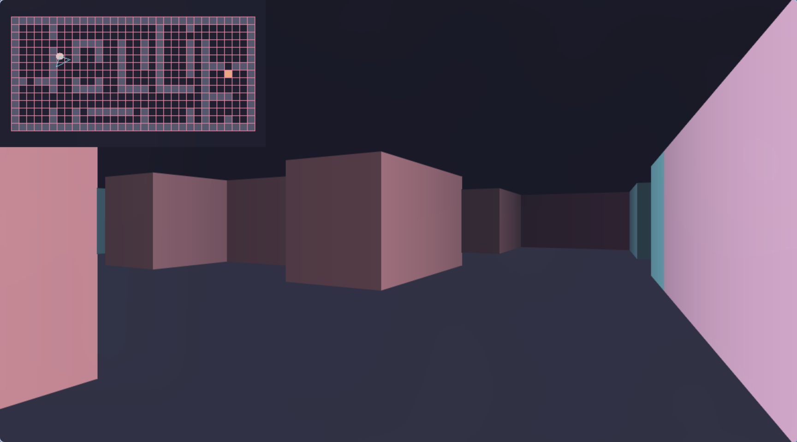

# Shirin - raycasting engine in C++ / SDL3



## Controls

| Input   | Action         |
| ------- | -------------- |
| W       | Move forward   |
| S       | Move backward  |
| A       | Strafe left    |
| D       | Strafe right   |
| Mouse X | Rotate view    |
| Escape  | Quit           |

## Purpose

- Recreational programming.
- DDA (Digital Differential Analyser) raycaster with perpendicular-distance projection to avoid
  fisheye distortion, `nextafterf()`-based boundary snapping, and AABB collision with
  axis-separated sliding response.
- Styled with the [Catppuccin Mocha](https://github.com/catppuccin/catppuccin) palette, distance
  fog, and a top-down minimap overlay.

## Requirements

- `g++` with C++23 support
- SDL3 (`libsdl3-dev` or equivalent)
- GNU Make

## Building (Recommended)

```sh
make compile   # build
make run       # build and run
make clean     # remove build artifacts
```

## Building with Meson + Ninja

- `meson` ≥ 1.0
- `ninja`

```sh
meson setup build   # configure (once)
ninja -C build      # build
./build/shirin      # run
ninja -C build -t clean  # clean
```

## Resources

- Lode's Raycasting Tutorial: [https://lodev.org/cgtutor/raycasting.html](https://lodev.org/cgtutor/raycasting.html)
- Tsoding's 3D in TypeScript using Ray Casting: [https://www.youtube.com/watch?v=K1xEkA46CuM](https://www.youtube.com/watch?v=K1xEkA46CuM)

## License

This project is licensed under the MIT License.
